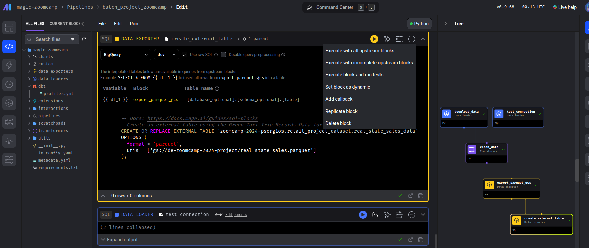

# Houses retail project

## Objectives
- This project are part of the final assesment of Data Engineer Zoomcamp. It contains an End-to-End pipeline <br>

## Problem description
- The Real Estate Sales project aims to provide insights into real estate sales data spanning from 2001 to 2021 sourced from [data.ct.gov](https://data.ct.gov/). The main objective is to assist various stakeholders in the real estate industry with data-driven decision-making processes. 

## Technologies
- Python
- Pandas
- Mage.ai
- Docker (Docker compose)
- GCP Bucket
- Terraform
- DBT

# Usage
- To reproduce this test you can clone the project using this link https://github.com/serpaulos/zoomcamp_project_2024
- Inside the root folder you can find the .env_model, copy/rename it to .env and change it accordingly.
- You will also need a GCP account to reproduce this project
- Configure the service account and save the JSON file inside the keys folder on root folder and change file name to google_creds.json. You will need to add these roles in addition to Viewer : Storage Admin + Storage Object Admin + BigQuery Admin
- [Installing Terraform](https://developer.hashicorp.com/terraform/tutorials/aws-get-started/install-cli)
- [Installing gcloud CLI](]https://cloud.google.com/sdk/docs/install)
- execute the command DOCKER-COMPOSE UP to spin the necessary enviroment.
- CD into terraform folder
- To create or update infrastructure use the command 
  ```bash
  terraform apply
  ```
- To spin the local enviroment use the command at the root directory
  ```bash
  docker-compose up
  ```
- you can access the mage by http://localhost:6789/pipelines, there you will find batch_project_zoomcamp pipeline <br>
<br>
- You need to choose the option "Execute with all upstream blocks" as showed in the picture


# Visualisation
- You will need [Google looker studio](https://lookerstudio.google.com/) to create your visualisation
- Connect to your database using the Big Query Connector feature
- Select your project and choose the dataset/data
- Create the  visualisation and share it ;)
<br>
- This is the visalization created to this project <br>
- 


## Contact
made by [@paulosilvajr](https://www.linkedin.com/in/paulosilvajr/) - feel free to contact me if you need!
